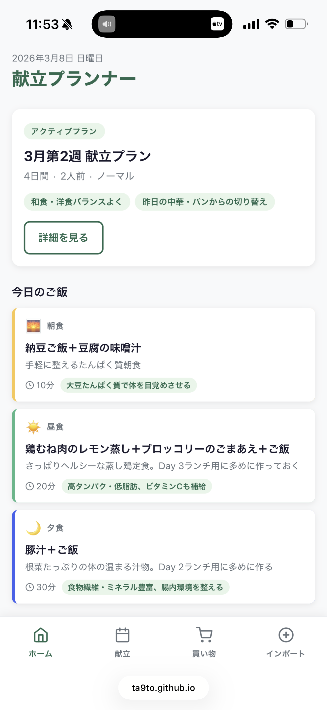
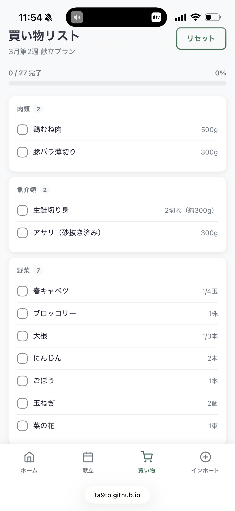
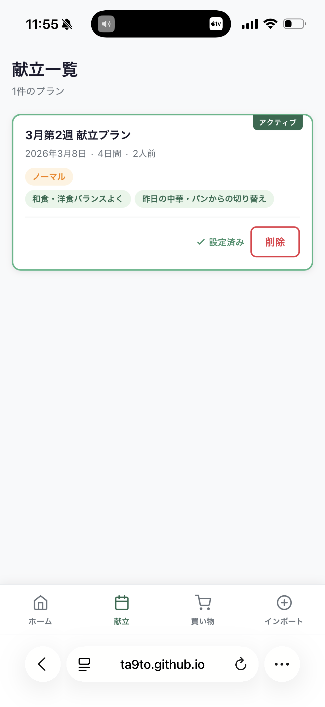
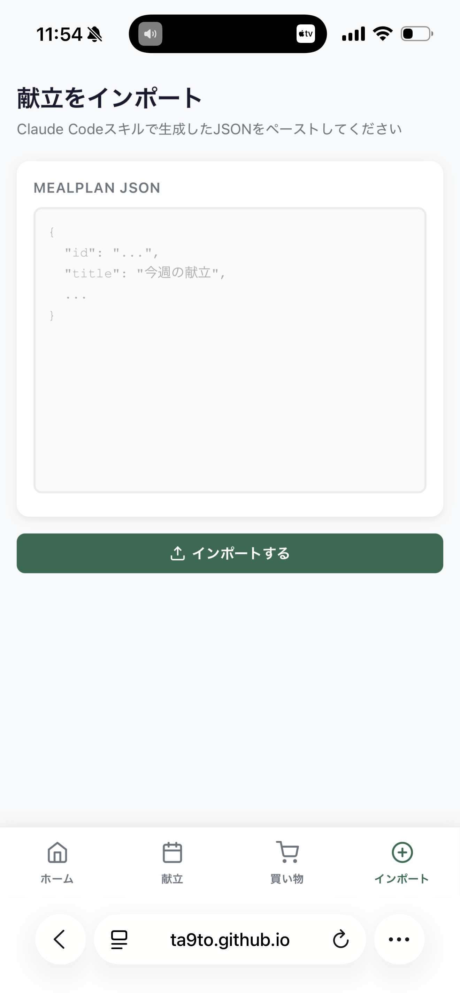

# 献立プランナー

食材を買いに行く前に、直近の食事内容・栄養バランス・気分をもとに数日分の献立と買い物リストを生成・管理するアプリです。

**公開URL**: https://ta9to.github.io/gohan-planner/

---

## スクリーンショット

<table>
  <tr>
    <td align="center"><b>ダッシュボード</b></td>
    <td align="center"><b>買い物リスト</b></td>
    <td align="center"><b>献立一覧</b></td>
    <td align="center"><b>インポート</b></td>
  </tr>
  <tr>
    <td></td>
    <td></td>
    <td></td>
    <td></td>
  </tr>
</table>

---

## 使い方

### 1. 献立を生成する（Claude Code スキル）

このリポジトリの `.claude/skills/gohan-planner/SKILL.md` を `~/.claude/skills/` にコピーすると、Claude Code で `/gohan-planner` スキルが使えるようになります。

```bash
cp -r .claude/skills/gohan-planner ~/.claude/skills/
```

Claude Code で `/gohan-planner` を実行すると、以下をヒアリングして献立プランをJSON形式で生成します：

- 直近3〜7日間に食べたもの
- 今の気分・体調
- 栄養上の気になりポイント（野菜不足など）
- プランする日数と人数
- アレルギー・苦手食材などの条件

### 2. アプリにインポートする

スキルが出力したJSONをコピーして、アプリの「インポート」画面にペーストするだけです。

### 3. 買い物リストを使う

スーパーで買い物しながら、カテゴリ別の買い物リストをチェックしていきます。完了した項目は下に移動し、進捗バーで残りを確認できます。

---

## 機能

| 画面 | 機能 |
|---|---|
| **ダッシュボード** | アクティブなプランの今日の献立（朝・昼・夜）を表示 |
| **献立一覧** | 保存済みプランの履歴・詳細確認・削除 |
| **買い物リスト** | カテゴリ別チェックリスト・進捗バー・リセット |
| **インポート** | スキル生成JSONのペースト取り込み |

---

## 技術スタック

- **フロントエンド**: React + TypeScript + Vite
- **スタイリング**: CSS Modules
- **データ永続化**: LocalStorage（バックエンドなし）
- **デプロイ**: GitHub Pages（GitHub Actions 自動デプロイ）

---

## 開発

```bash
npm install
npm run dev    # 開発サーバー起動
npm run build  # プロダクションビルド
```

`main` ブランチへの push で GitHub Pages に自動デプロイされます。
